# 💰 SpendSmart – Personal Finance & Budgeting Assistant

<div align="center">

### Smart Expense Tracking • Budget Management • OCR Receipt Scanning • Financial Analytics

A modern full-stack personal finance management application that helps users track expenses, manage budgets, analyze spending patterns, and simplify financial management through OCR-powered receipt scanning and interactive dashboards.

</div>

---

## 📌 Overview

SpendSmart is a web-based personal finance and budgeting platform designed to help users efficiently manage their income, expenses, and budgets in one place.

The application enables users to:

* Track income and expenses
* Categorize financial transactions
* Manage monthly budgets
* Upload receipts using OCR technology
* Analyze spending patterns
* View financial reports through interactive dashboards

Built using **React**, **Spring Boot**, **REST APIs**, and **MySQL**, SpendSmart provides a secure, scalable, and user-friendly solution for personal finance management.

---

## ✨ Features

### 🔐 Secure User Authentication

* User Registration
* User Login
* Password Encryption using BCrypt
* Spring Security Integration
* Secure User Validation

### 💸 Expense & Income Management

* Add Income Records
* Add Expense Records
* Categorized Transactions
* Transaction History Management
* Financial Record Tracking

### 📄 OCR-Based Receipt Scanning

* Upload Receipt Images
* Automatic Data Extraction
* Auto-Fill Transaction Forms
* Reduced Manual Data Entry
* Faster Expense Recording

### 🎯 Budget Management

* Create Category-Based Budgets
* Track Spending Against Budget Limits
* Budget Monitoring
* Overspending Detection
* Budget Overview Dashboard

### 📊 Financial Reports & Analytics

* Income vs Expense Analysis
* Category-Wise Spending Reports
* Financial Dashboard
* Interactive Charts & Graphs
* Spending Trend Analysis

### 🧠 Financial Insights

* Spending Pattern Analysis
* Expense Trend Monitoring
* Better Financial Awareness
* Data-Driven Financial Decisions

---

## 🏗️ System Architecture

```text
┌─────────────────────────────┐
│        React Frontend       │
│ Dashboard • Reports • OCR   │
└─────────────┬───────────────┘
              │ REST APIs
              ▼
┌─────────────────────────────┐
│     Spring Boot Backend     │
│ Business Logic • Security   │
│ Transaction Management      │
└─────────────┬───────────────┘
              │
              ▼
┌─────────────────────────────┐
│        MySQL Database       │
│ Users • Budgets • Records   │
└─────────────────────────────┘

Additional Modules:
• OCR Processing Module
• Analytics Module
• Budget Monitoring Module
```

---

## 🛠️ Tech Stack

### Frontend

* React.js
* Tailwind CSS
* Axios
* React Router DOM

### Backend

* Java
* Spring Boot
* Spring Security
* REST APIs
* Maven

### Database

* MySQL

### OCR Integration

* Tesseract OCR

### Development Tools

* IntelliJ IDEA
* VS Code
* Postman
* Git
* GitHub

---

## 📂 Core Modules

### 1. User Management Module

* User Registration
* User Login
* Password Security
* User Profile Management

### 2. Transaction Management Module

* Income Tracking
* Expense Tracking
* Transaction Categorization
* Financial Record Storage

### 3. Budget Management Module

* Budget Creation
* Budget Monitoring
* Spending Analysis
* Budget Status Tracking

### 4. OCR Processing Module

* Receipt Upload
* Data Extraction
* Automatic Form Population

### 5. Analytics Module

* Spending Reports
* Expense Analysis
* Financial Insights
* Dashboard Visualization

---

## ⚙️ Functionalities

### User Authentication

* Secure user registration
* Login validation
* Encrypted password storage
* User account management

### Transaction Management

* Add transactions
* Edit transactions
* Delete transactions
* Categorize transactions
* Track financial records

### OCR Receipt Processing

* Upload receipt images
* Extract amount details
* Extract transaction dates
* Identify expense categories
* Auto-fill transaction forms

### Budget Management

* Create budget limits
* Monitor spending
* Compare expenses with budgets
* Detect overspending

### Reporting & Analytics

* View total income
* View total expenses
* View remaining balance
* Analyze spending categories
* Generate financial reports

---

## 📈 Application Workflow

1. User registers and logs into the system.
2. User records income and expense transactions.
3. Transaction data is stored in the MySQL database.
4. OCR module extracts information from uploaded receipts.
5. Budget module monitors spending against defined limits.
6. Analytics module processes transaction data.
7. Dashboard displays reports and spending insights.
8. Users analyze their financial activities and make informed decisions.

---

## 🔒 Security Features

* Password Encryption using BCrypt
* Spring Security Configuration
* Secure User Authentication
* Protected User Data
* Input Validation

---

## 📸 Application Screens

### 🏠 Home Page

Landing page showcasing platform features and capabilities.

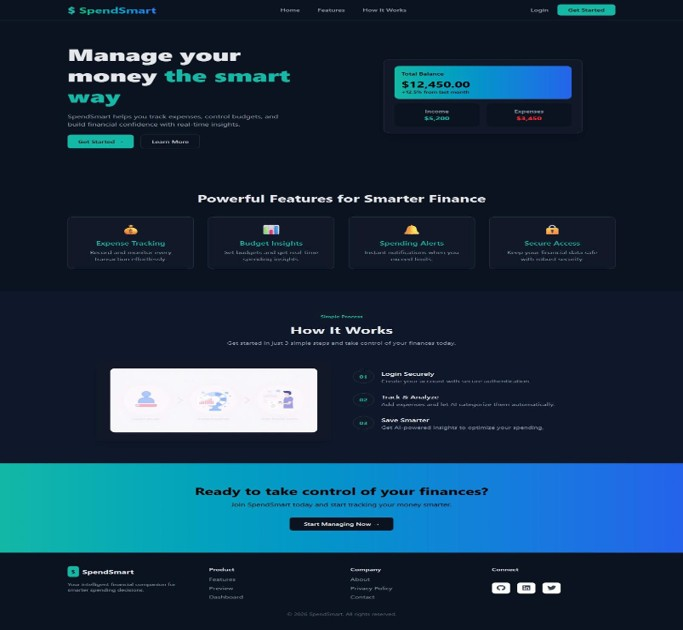

---

### 📝 Registration Page

Create a new SpendSmart account.

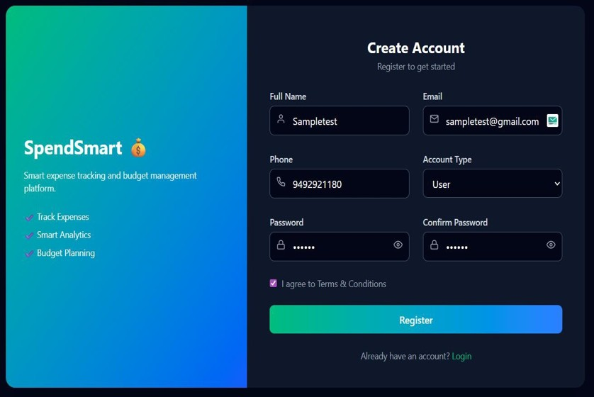

---

### 🔑 Login Page

Secure user login interface.

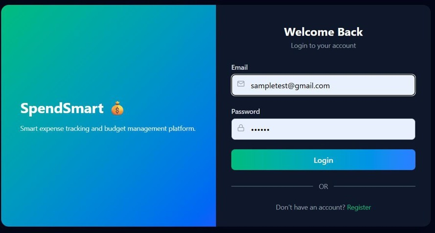

---

### 📊 User Dashboard

Overview of income, expenses, remaining balance, and spending distribution.

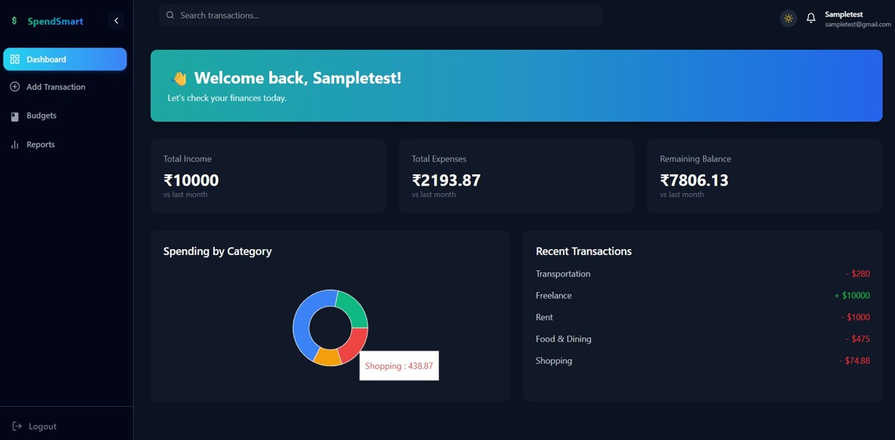

---

### ➕ Add Transaction

Record income and expense details.

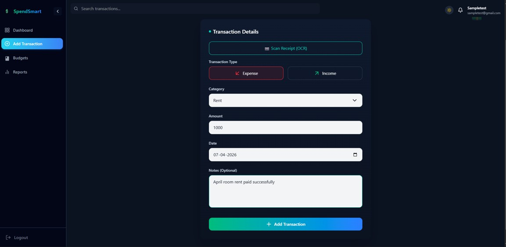

---

### 📄 OCR Instructions

Guidelines for uploading receipts for OCR processing.

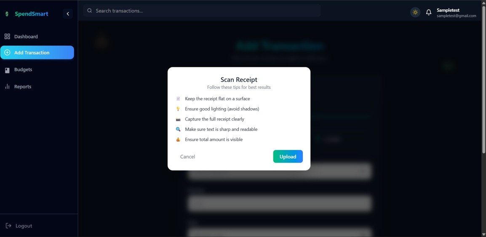

---

### 🤖 Auto Fill Using OCR

Automatically extract transaction details from receipts and populate transaction fields.

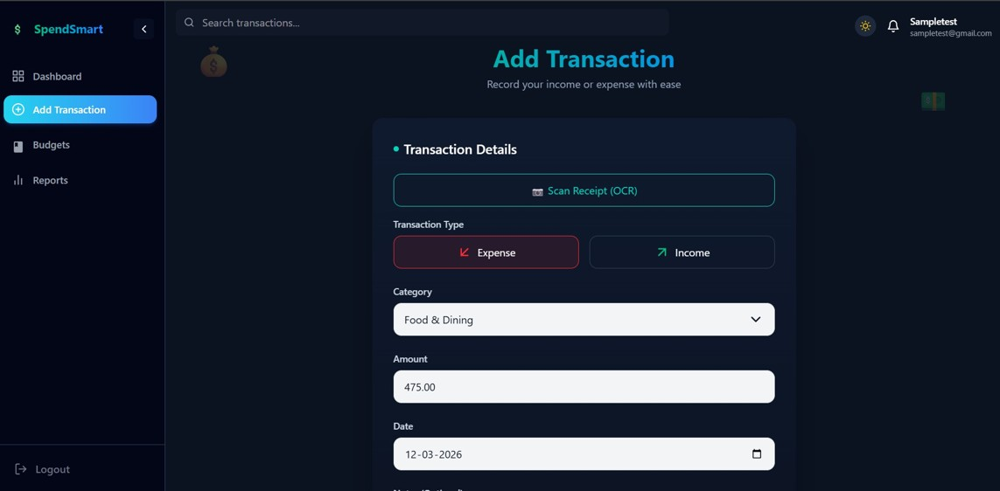

---

### 💰 Add Budget

Create category-based budget limits.

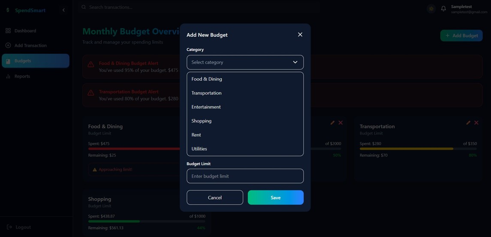

---

### ⚠️ Budget Monitoring

Track spending and identify budget limit exceedance.

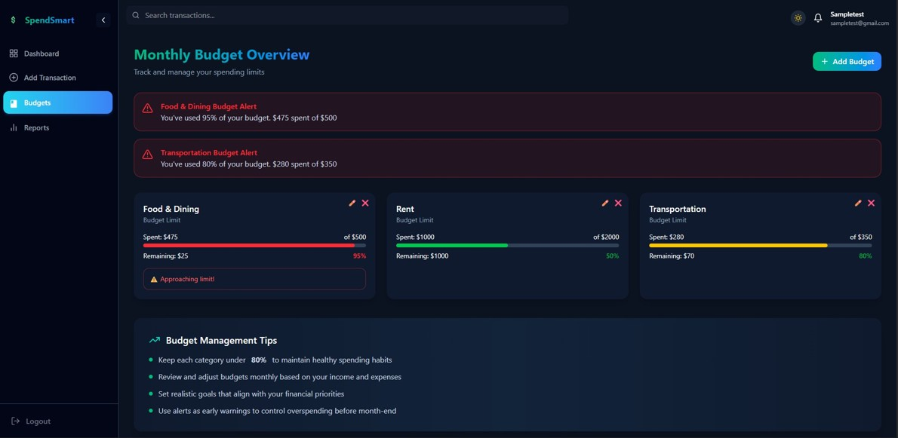

---

### 📈 Reports & Analytics

Interactive charts and financial reports.

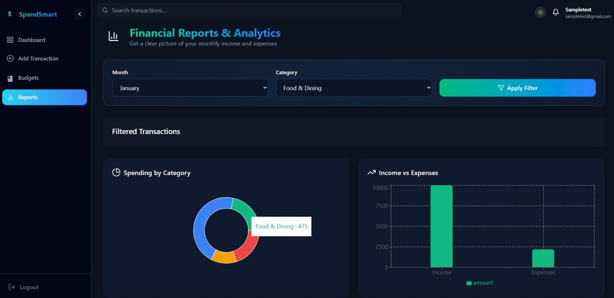

---

### 🧠 Financial Insights

Analyze spending behavior and expense trends.

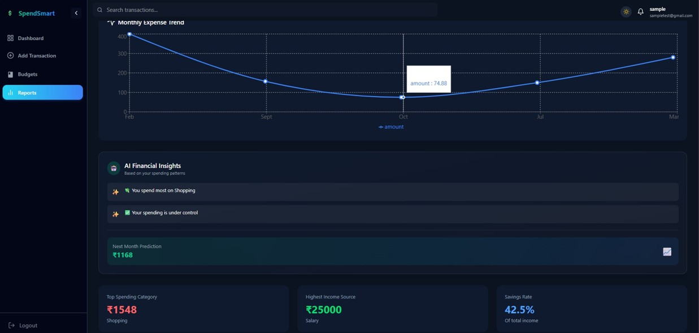
---

## 🎯 Target Users

### 👨‍🎓 Students

Track daily expenses and improve budgeting habits.

### 👨‍💼 Professionals

Manage finances and monitor spending efficiently.

### 👨‍👩‍👧‍👦 Families

Plan household budgets and track financial activities.

---

## 📋 Software Requirements

### Frontend

* React.js
* Tailwind CSS

### Backend

* Java 17+
* Spring Boot

### Database

* MySQL

### Tools

* IntelliJ IDEA / VS Code
* Maven
* Postman
* Git

---

## 🚀 Installation & Setup

### Clone the Repository

```bash
git clone https://github.com/Vardhan09-web/SpendSmart.git
cd SpendSmart
```

### Backend Setup

```bash
cd backend

mvn clean install
mvn spring-boot:run
```

### Configure Database

Update your `application.properties` file:

```properties
spring.datasource.url=YOUR_DATABASE_URL
spring.datasource.username=YOUR_USERNAME
spring.datasource.password=YOUR_PASSWORD
```

### Frontend Setup

```bash
cd frontend

npm install
npm run dev
```

---

## 📊 Project Highlights

✅ Full-Stack Web Application

✅ Spring Boot REST APIs

✅ OCR-Based Receipt Scanning

✅ Budget Management System

✅ Financial Analytics Dashboard

✅ Password Encryption with BCrypt

✅ Responsive User Interface

✅ MySQL Database Integration

---

## 🔮 Future Enhancements

* Email Notifications
* Advanced Financial Forecasting
* Mobile Application Support
* Bank Account Integration
* Smart Savings Recommendations
* Cloud Deployment

---

## 👥 Development Team

* **M. Vardhan**
* **S. Rishitha**
* **R. Sai Abhiram**
* **S. R. Dinesh Ananth**


### Mentor

**Dr. B. Sateesh Kumar**
Professor, Department of Computer Science & Engineering

---

## ⭐ Conclusion

SpendSmart provides a practical and user-friendly solution for personal finance management by combining expense tracking, budget monitoring, OCR-powered receipt processing, and financial analytics into a single platform.

The application helps users organize their finances, understand spending behavior, and make better financial decisions through an intuitive and modern web interface.

---

<div align="center">

### ⭐ If you found this project useful, consider giving it a star!

</div>
